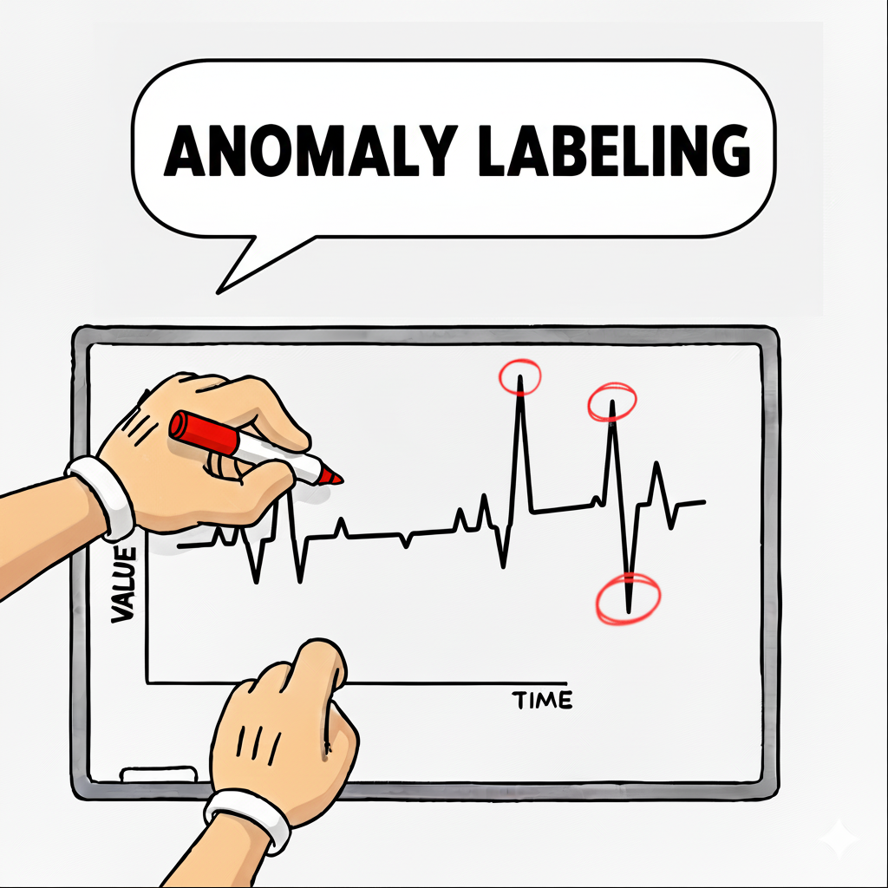
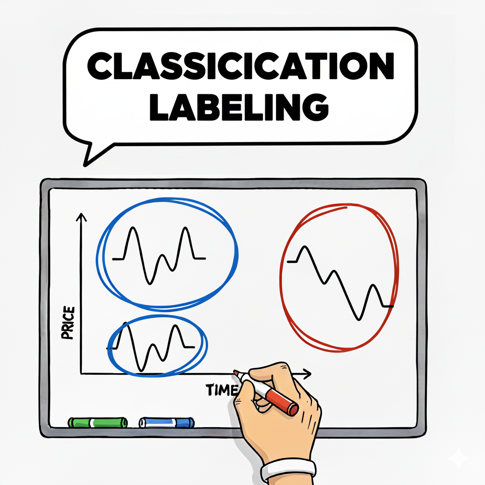
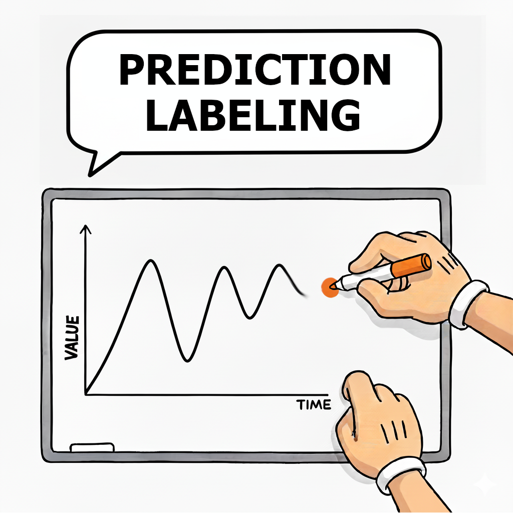

# Time Series Labeling Tool

A universal, extensible tool for labeling time series with interactive visualization and intelligent similarity search.

<p align="center">
  
    
  
</p>

<p align="center">
  &nbsp; <b>Detect</b> anomalies|&nbsp; <b>Classify</b> patterns &nbsp;|<b>Predict</b> future values &nbsp;
</p>

## Demo


## Quick Start

1.  **Install dependencies:**
    ```bash
    pip install -r requirements.txt
    ```

2.  **Run the application:**
    ```bash
    python app.py
    ```

3.  **Start Labeling:**
    -   Load your data (dataset folder with generated examples, load each numpy file).
    -   Select your mode (Predict, Classify, or Anomaly) in the settings tab.
    -   Use keyboard shortcuts `←/→` to navigate between examples, `D` to find similar examples, `S` to save to speed up your workflow.

### 📂 Data Files
To start, ensure your dataset folder contains:
-   ✅ **`prices.npy`** (Required)
-   ✅ **`timestamps.npy`** (Required)
-   ❔ `ids.npy` (Optional)
-   ❔ `cluster_ids.npy` (Optional - pre-generated cluster labels to assist labeling)
-   ❔ `predicted_prices_to_help.npy` (Optional - predictions from trained models to assist labeling)
-   ❔ `metadata.json` (Optional)

> 💡 **Tip:** You can use the `datasets/example_data` folder to test the tool immediately.

> 💡 **Tip:** If a `metadata.json` file exists, load it first to restore all previous settings!

---


## Features

**Three Labeling Modes**
-   **Predict Mode**: Label future price values (1 or 2 prices)
-   **Classify Mode**: Categorize time series into N classes
-   **Anomaly Detection Mode**: Mark anomaly points in time series

**Intelligent Similarity Search**
-   Find similar labeled series using Soft-DTW algorithm
-   Helpful for consistent labeling decisions
-   Visual comparison of query vs similar series

**Interactive UI**
-   Modern tabbed settings window
-   Real-time visualization with matplotlib
-   Keyboard shortcuts for efficient labeling

**Flexible Visualization**
-   Configurable padding and margins
-   Highlighting of specific data points
-   Zoom and region selection
-   Automatic timestamp formatting

**Persistent Settings**
-   Settings saved automatically in `settings.json`
-   Resume labeling sessions with same configuration
-   Per-dataset descriptions

---

## Detailed Documentation

### Installation and Launch

#### Option 1: Using `pipenv`

```bash
# Install pipenv if needed
pip install pipenv

# Install dependencies
pipenv install

# Activate environment
pipenv shell

# Run application
python app.py
```

#### Option 2: Using `pip` and `requirements.txt`

```bash
# Install dependencies
pip install -r requirements.txt

# Run application
python app.py
```

### Architecture

The tool uses a modular, extensible architecture:

```
src/
├── dataset_loader.py        # NumPy dataset loading
├── labeling_types/          # Labeling implementations
│   ├── base.py             # Abstract base class
│   ├── predict.py          # Price prediction labeling
│   ├── classify.py         # Classification labeling
│   └── anomaly_detection.py # Anomaly detection labeling
│
├── similarity/              # Similarity search algorithms
│   ├── base.py             # Abstract similarity interface
│   └── soft_dtw.py         # Soft-DTW implementation
│
├── settings/                # Settings management
│   ├── settings_manager.py # JSON persistence
│   ├── settings_window.py  # Tabbed UI
│   └── last_metadata_path.py # Last used metadata tracking
│
└── ui/                      # UI components (reserved for future use)
```

### Labeling Types Details

#### Predict Mode
Label future price values for time series forecasting tasks.
-   **Controls**: Click on plot to set price, `D` for similarity, `←/→` to navigate.
-   **Settings**: `num_prices` (1-3).

#### Classify Mode
Categorize time series into predefined classes.
-   **Controls**: `1-N` to assign class, `S` for similarity.
-   **Settings**: `num_classes` (2-10).

#### Anomaly Detection Mode
Mark anomaly points in time series.
-   **Controls**: Click points to mark/unmark.

### Configuration

Settings are stored in `settings.json`.

**Key Options:**
-   **Visualization**: `right_padding`, `y_padding_percent`.
-   **Similarity**: `method` (soft_dtw), `gamma` (softness).

### Data Format

The tool uses NumPy arrays (`.npy`) stored in a single folder.

#### 📄 File Descriptions

-   **`prices.npy`** (Required)
    -   **Content**: The actual time series data (e.g., stock prices, sensor readings).
    -   **Shape**: `(N, seq_len)` where `N` is the number of samples and `seq_len` is the length of each series.
    -   **Type**: Float.

-   **`timestamps.npy`** (Required)
    -   **Content**: Time values corresponding to the data points.
    -   **Shape**:
        -   `(N, seq_len)`: Unique timestamps for each sample.
        -   `(N,)` or `(seq_len,)`: Shared timestamps for all samples.
    -   **Type**: Float or Int (Unix timestamps recommended).

-   **`ids.npy`** (Optional)
    -   **Content**: Unique string or integer identifiers for each time series sample.
    -   **Shape**: `(N,)`.
    -   **Usage**: displayed in the UI to help identify specific samples.

-   **`cluster_ids.npy`** (Optional)
    -   **Content**: Pre-generated cluster labels to assist with consistent labeling decisions.
    -   **Shape**: `(N,)`.
    -   **Usage**: Displayed in the UI to help identify and group similar patterns, assisting with consistent labeling decisions.

-   **`predicted_prices_to_help.npy`** (Optional)
    -   **Content**: Pre-computed predictions from trained ML models to assist with labeling.
    -   **Shape**: `(N,)` or `(N, num_predictions)`.
    -   **Usage**: Displayed in the UI as reference points to speed up manual labeling.

-   **`labels.npy`** (Auto-generated)
    -   **Content**: The labels you create.
    -   **Shape**: Depends on labeling mode (e.g., `(N, num_prices)` for Predict, `(N,)` for Classify).
    -   **Usage**: Automatically saved and loaded to persist your work.

-   **`metadata.json`** (Optional)
    -   **Content**: JSON file containing dataset description and default settings.
    -   **Usage**: Auto-configures the tool when loading the dataset.


### Extending the Tool

-   **New Labeling Type**: Inherit from `BaseLabelingType` in `src/labeling_types/`.
-   **New Similarity Method**: Inherit from `BaseSimilarityFinder` in `src/similarity/`.

## Contributing

Feel free to fork the repository, open issues, and submit pull requests.

## License

Copyright (c) 2023-2025 [dr11m]. All rights reserved.

---

*P.S. This tool has been used in the labeling of tens of thousands of time series for production ML models.*
