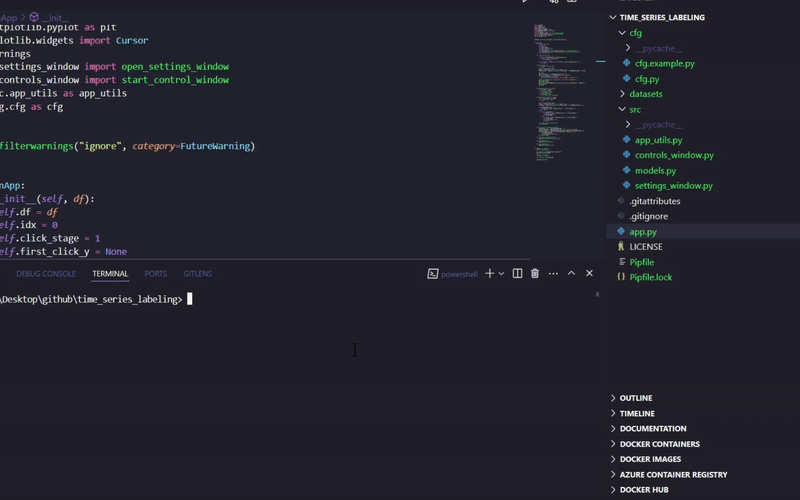

# Time Series Labeling Tool

A universal tool for labeling time series with interactive visualization.

## Table of Contents

- [Demo](#demo)
- [Instructions](#instructions)
- [Installation and Launch](#installation-and-launch)
- [Data Preparation](#data-preparation)
- [Data Format](#data-format)
- [Contributing](#contributing)
- [TODO](#todo)

## Demo

Here’s a short demo of how the tool works:




*P.S. I've used this code in the labeling of tens of thousands of time series. Now in production I am using a newer version (plotly.js + fastapi, which is more flexible, faster and has a lot of cool tools), maybe I will find time and a way to put this version into open source as well.*

## Instructions

After launching you will go to a simple settings menu, after that you can start labeling!

- If labeling 1 price, click in the desired place on the plot (the price you want to set) as `labeled_price_1`.
- If labeling 2 prices, click once for `labeled_price_1` and click again for `labeled_price_2`.
*see `Number of prices to label` in the settings menu at launch*
- Press 'd' to find similar time series using DTW (Euclidean distance).
- Use the backward and forward arrows (← →) to move between the plots
- Press 'f' to filter time series by length (new universal app only)

*The labeled data will be saved in the `datasets/in_process_of_labeling` folder.*

## Installation and Launch

You can install the necessary dependencies in two ways:

### Option 1: Using `pipenv`

1. Install `pipenv` if you don't have it already:

   ```bash
   pip install pipenv
   ```

2. Install dependencies from the `Pipfile`:

   ```bash
   pipenv install
   ```

3. To activate the virtual environment, run:

   ```bash
   pipenv shell
   ```

4. Run the application:

   ```bash
   python app.py
   ```
   or
   ```bash
   pipenv run python app.py
   ```

### Option 2: Using `pip` and `requirements.txt`

1. Install dependencies using `pip`:

   ```bash
   pip install -r requirements.txt
   ```

2. Run the application:

   ```bash
   python app.py
   ```


1. Run the application with:

   ```bash
   python app.py
   ```

2. The application will open a window where you can label the prices of time series.

3. Once you've finished labeling, the labeled data will be saved in the `datasets/in_process_of_labeling` folder.


## Data Preparation
Convert your data to JSON format according to the specification below.


### Pydantic Model
*just check*
```python
from src.data_formats import DataAdapter, TimeSeriesDataset
```

### JSON Format (Only Supported Format)
```json
{
  "name": "Dataset Name",
  "description": "Dataset description",
  "series": [
    {
      "id": "series_1",
      "name": "Time Series 1",
      "points": [
        {"timestamp": 1731535200, "value": 1.73},
        {"timestamp": 1737842400, "value": 1.75}
      ],
      "metadata": {
        "buy_price": 1.5,
        "sell_price": 1.88
      },
      "labeled_values": {
        "price_1": 1.85,
        "price_2": 1.92
      }
    }
  ]
}
```

### Format Specification

#### TimeSeriesDataset (root object)
- `name` (string, required) - dataset name
- `description` (string, optional) - dataset description
- `series` (array, required) - array of time series
- `metadata` (object, optional) - dataset metadata
- `created_at` (datetime, optional) - creation date

#### TimeSeries (time series)
- `id` (string, required) - unique series identifier
- `name` (string, optional) - series name/description
- `points` (array, required) - array of time series points
- `metadata` (object, optional) - series metadata
- `labeled_values` (object, optional) - labeled values

#### TimeSeriesPoint (time series point)
- `timestamp` (number/string, required) - timestamp (Unix timestamp or datetime string)
- `value` (number, required) - value at this point
- `metadata` (object, optional) - additional point data

#### labeled_values (labeled values)
- `price_1` (number, optional) - first labeled price
- `price_2` (number, optional) - second labeled price
- You can add any other keys for additional labels


### 1. Implement Adapter
```python
# database/database_adapter.py
  from src.data_formats import DataAdapter, TimeSeriesDataset

  class DatabaseAdapter(DataAdapter):
      def __init__(self, config):
          # Your database connection initialization
          
      def load_data(self, source=None, query_params=None) -> TimeSeriesDataset:
          # Your database data loading logic
          
      def save_data(self, dataset: TimeSeriesDataset, destination: str) -> None:
          # Your database data saving logic
```

### 2. Use in Application
```python
from database.database_adapter import DatabaseAdapter
from database.config import DB_CONFIG

# Load data from database
adapter = DatabaseAdapter(DB_CONFIG)
dataset = adapter.load_data(query_params={'start_date': '2024-01-01'})
```


## Contributing

Feel free to fork the repository, open issues, and submit pull requests. Contributions are welcome!


  ## TODO:

  - [x] Change the input data format so that it is possible to label time series of any length (by specifying the desired size in the settings).
  - [x] Add comprehensive data filtering system with multiple criteria
  - [x] Add duplicate removal and sale time analysis capabilities
  - [x] Add visual analysis tools for rejected series
  - [ ] Add support for more data formats (Parquet, HDF5)
  - [ ] Add batch processing capabilities
  - [ ] Add export to different formats

  **Authors**

  * [dr11m](https://github.com/dr11m)

  **Copyright**

  Copyright (c) 2023 [dr11m]. All rights reserved.